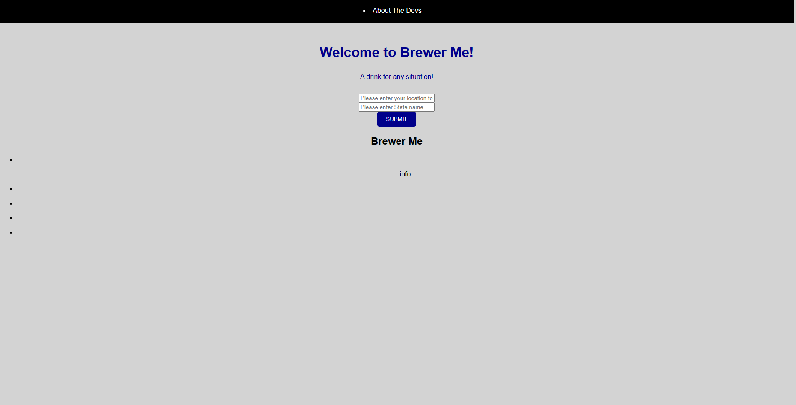

# BrewerMe
A simple app to locate the nearest brewery and recommend beverages based on local weather.

## UserStory

As a Tourist
I want to be able to locate Breweries near me while traveling
So that I can broaden my experience with different types of Alcoholic Beverages.
I also want to recive beverage suggestions based on local weather
So that I can maximize my personal enjoyment of said beverage.

This app works by taking in city and state locations provided by a user and passes that information into a third-party API called openbreweryAPI to locate breweries in the local area. The city input is passed into an openweatherAPI to return the local weather. A list of 5 breweries is returned with additional contact information and a link to that brewery's website, if available. Based off of weather conditions, a type of beverage is then suggested.

https://willisson7.github.io/BrewerMe/